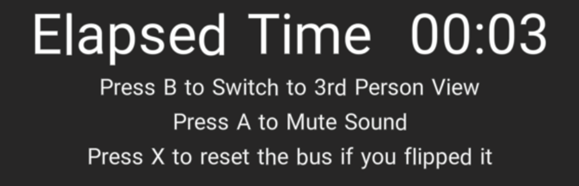
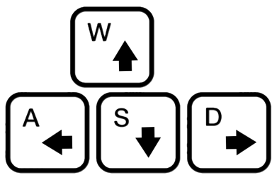
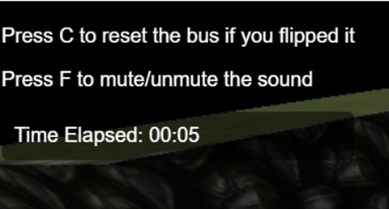

# VR_Bus_2
## User Manual
User Manual

For VR-mode (Base on Meta Quest 2 controller layout):

Left joystick: Move forward to accelerate, backward to decelerate.

Right joystick: Move left to steer left, right to steer right.

  

“A” button on the right joystick: Press once to mute all sound. Press again to unmute.
 

“B” button on the right joystick: Press once to switch to 3rd person view. Press again to revert to 1st person view.

 
“X” button on the left joystick: Press once to reset the vehicle if flipped.

The HUD at the upper right shows time elapsed since the game started, as well as the button layout.

 
For non-VR mode (Keyboard):
“WASD”: Press W to accelerate. Press S to decelerate or reverse the bus.
Press A/D to steer left/right.

 
“F”: Press once to mute all sound. Press again to unmute.

 
“C”: Press once to reset the vehicle if flipped.

 

The HUD at the upper left shows time elapsed since the game started, as well as the button layout

 
